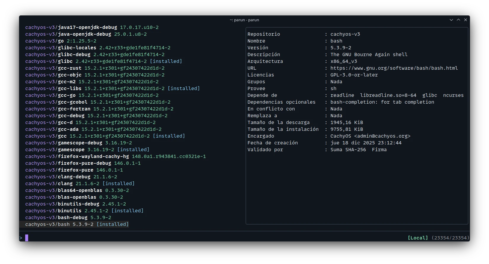

# Parun

**Parun** is a modern, high-performance Terminal User Interface (TUI) for package management, designed for **Arch Linux** and the **Nim** ecosystem.

<div align="center">
  
  <br>
</div>

Written in [Nim](https://github.com/nim-lang/Nim) and optimized with SIMD instructions, Parun offers a blazing fast search and management experience for Pacman, AUR (Arch User Repository), and Nimble repositories.

## Key Features

- **Extreme Performance**: Uses `nimsimd` for hardware-accelerated text filtering and searching.
- **Unified Management**: Manage system packages (Pacman), community packages (AUR), and Nim language packages (Nimble) from a single interface.
- **Multi-Selection**: Select multiple packages to install or uninstall in batches.
- **Intuitive Interface**: Real-time searching, package details view, and fluid keyboard navigation.
- **Details Mode**: View extended package information (version, description, license, etc.).

## Requirements

- **OS**: Arch Linux or Arch Linux based distro
- **Nim**: [Install Nim](https://nim-lang.org/)

<!--## Installation-->

<!--The easiest way to install Parun is using `nimble`:

```bash
nimble install https://github.com/gabrielcapilla/parun.git
```-->

## Build

Compile the project from source and generate an optimized release version:

1.  Clone the repository:

    ```bash
    git clone https://github.com/gabrielcapilla/parun.git
    cd parun
    ```

2.  Run the defined build task (requires `nimble`):

    ```bash
    nimble release
    ```

3.  Install in your local folder bin:
    ```bash
    mv parun $HOME/.local/bin
    ```

## Usage

To start the application, simply run:

```bash
parun
```

### Command Line Options

You can launch Parun in specific modes or with initial configurations:

| Option              | Description                                   |
| :------------------ | :-------------------------------------------- |
| `-n`, `--noinfo`    | Start with the package details panel hidden.  |
| `--nim`, `--nimble` | Start directly in Nimble package search mode. |

### Keyboard Shortcuts & Controls

Once inside the application, use the following controls to navigate and manage packages:

**Navigation & Search**

- **Typing**: Filter the package list in real-time.
- **Up / Down Arrows**: Move the cursor through the package list.
- **PgUp / PgDn**: Scroll by pages.
- **F1**: Show/Hide the package details panel.
- **Esc**: Quit the application.

**Package Management**

- **Tab**: Select/Deselect the current package (for multi-selection).
- **Enter**: Install selected packages (or the current one if no selection).
- **Ctrl + R**: Uninstall (Remove) selected packages.
- **Ctrl + S**: Toggle view to show only selected packages.

**Quick Search Commands**
You can switch package sources by typing special prefixes in the search bar:

- `aur/` : Switch to AUR search.
- `nim/` or `nimble/` : Switch to Nimble search.
- Any other input returns to the default mode (System Packages/Local).

---

_Parun does not require an external configuration file. However, it internally interacts with `pacman`, `paru`, `yay`, and `nimble` commands. Ensure these are installed._

---

## Repository & Support

- **GitHub:** [gabrielcapilla/parun](https://github.com/gabrielcapilla/parun)
- **Nostr:** [@gabrielcapilla](https://nostree.me/npub1uf2dtc8wfpd7g4papst44uy0yzlnud54tzglhffrr3yvh6hnjefq4uy52e)
