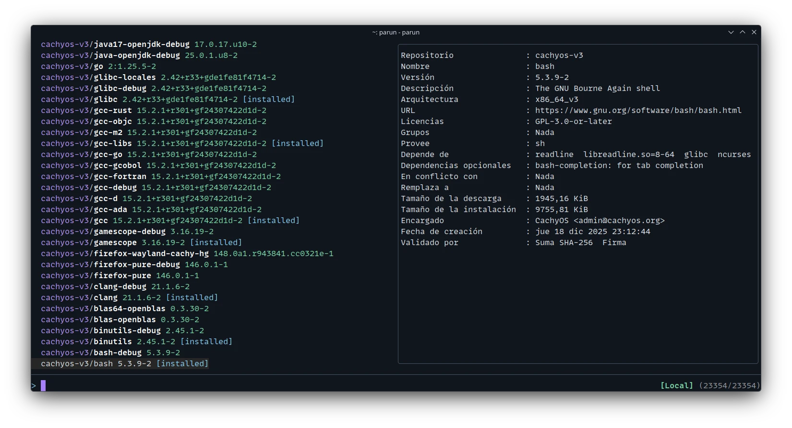

# Parun

A powerful terminal-based package manager for Pacman, AUR, and Nimble



## Features

- Unified management: Pacman, AUR, and Nimble packages
- Multi-selection and batch operations
- Real-time search with package details

## Install

**Quick install (binary):**

```bash
curl -fsSL gabrielcapilla.github.io/install | bash -s parun
```

**Or install with Nimble (requires Nim):**

```bash
nimble install parun
```

## Usage

```bash
parun              # Start in default mode
parun --nim        # Nimble-only source mode (alias: --nimble)
parun --aur        # AUR-only source mode
parun --aur --pacman --nimble  # Explicitly enable all sources
parun --noinfo     # Hide details panel
```

Default `parun` behavior is unchanged: Local (pacman) is the default view and
you can switch on demand with `aur/` and `nim/` prefixes.

When any of `--pacman`, `--aur`, or `--nimble` is passed, those flags become
an explicit source filter and unprefixed search shows the combined selected
sources by default. `--pacman` is not implied by `--aur`.

### Navigation

- **Arrow keys** · Move through packages
- **PgUp / PgDn** · Scroll by pages
- **F1** · Toggle details panel
- **Esc** · Quit

### Package Management

- **Tab** · Select/deselect package for batch operations
- **Enter** · Install highlighted package, or all selected packages
- **Ctrl+R** · Remove selected packages
- **Ctrl+S** · Show only selected

### Quick Search

Type prefixes to switch between package sources:

- **aur/** · Search AUR packages (alias: `a/`)
- **nim/** · Search Nimble packages (alias: `n/`, `nimble/`)
- **installed/** · Show only installed packages (alias: `i/`)

## Runtime Engineering

Parun uses immutable memory-mapped source indexes for local, AUR, and Nimble search. The interactive path keeps package corpora out of mutable heap state and only promotes owned strings at explicit cold boundaries such as details and package transactions.

Current target budgets for the indexed runtime:

- idle `RSS <= 12 MiB`
- idle `PSS <= 8 MiB`
- idle `Private_Dirty <= 6 MiB`
- visible `aur/` and `nim/` switch latency `<= 25 ms`

Release tasks:

```bash
nimble release       # deterministic public build
nimble releaseNative # host-optimized local build (not for redistribution)
```

---

Parun internally uses `pacman`, `paru`/`yay`, and `nimble` commands.

#### Repository & Support

- [GitHub](https://github.com/gabrielcapilla/parun)
- [Nostr](https://nostree.me/npub1uf2dtc8wfpd7g4papst44uy0yzlnud54tzglhffrr3yvh6hnjefq4uy52e)
